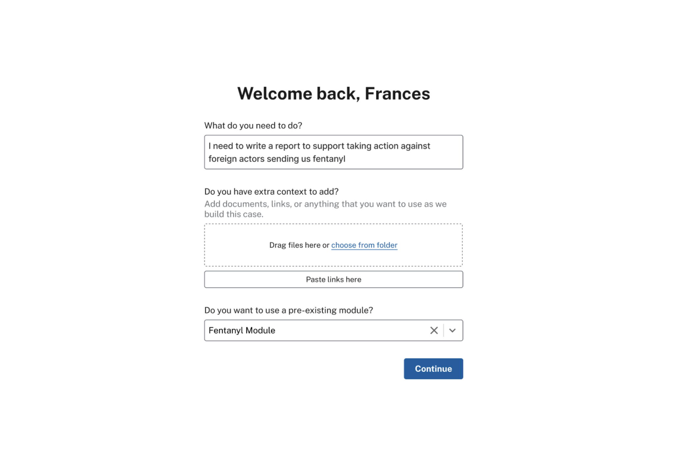
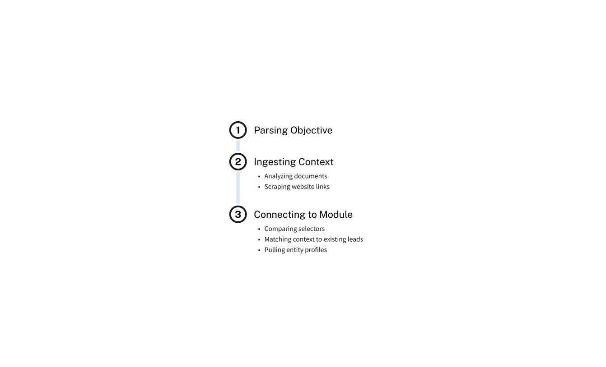
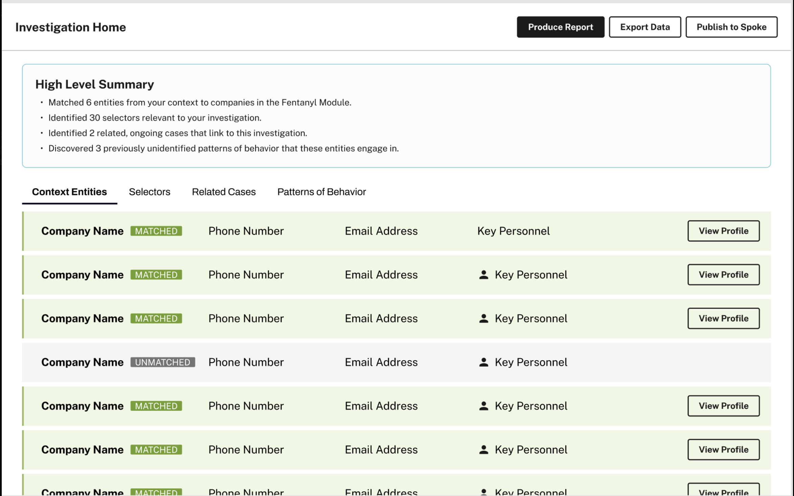
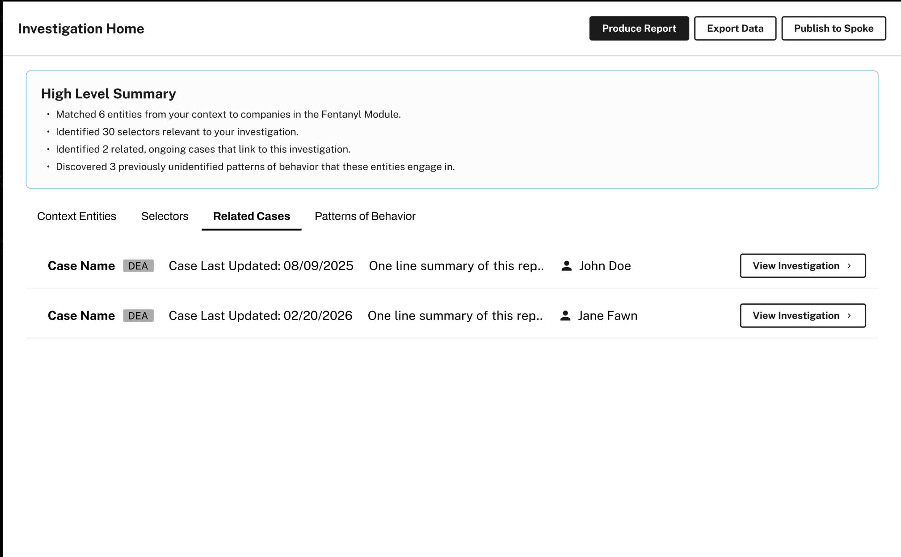
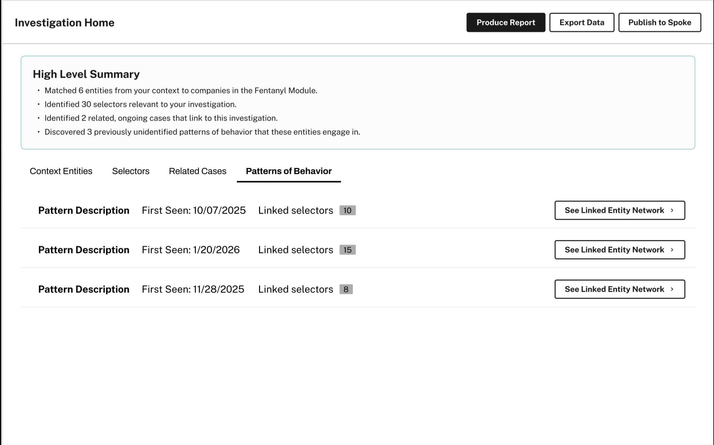

# Holocron

> A hackathon demo for turning scattered counter-narcotics research into a shared investigation workspace.

`Rails 8` `Hotwire` `Tailwind` `SQLite` `USWDS-inspired UI` `demo dataset`

Holocron is built for an analyst like Frances at State/INL: define an objective, ingest context, map it to a module, and surface the entities, selectors, related cases, and behavior patterns that matter fastest. The current repo is a polished hackathon demo with seeded data and clear extension points for live integrations.

## Why This Matters

- Analysts start from fragmented context: links, notes, documents, spreadsheets, and marketplace traces.
- Existing workflows are slow, manual, and hard to share across offices.
- Holocron compresses that into one guided flow: intake, triage, enrichment, and investigation handoff.

## Demo Flow

```text
[Objective]
    |
    v
[Links / Files]
    |
    v
[Module Selection]
    |
    v
[Parse + Ingest]
    |
    v
[Entities + Selectors]
    |
    v
[Related Cases]
    |
    v
[Patterns]
    |
    v
[Report + Share]
```

## What Reviewers Should Look At

1. Start on the intake screen and enter any investigation objective.
2. Watch the setup sequence simulate parsing, scraping, and module matching.
3. Land in `Investigation Home` and click through:
   `Context Entities`, `Selectors`, `Related Cases`, and `Patterns of Behavior`.

## Workflow Screens

### 1. Intake


The analyst defines the mission, attaches context, and selects a prebuilt module to accelerate matching.

### 2. Parsing


The app makes ingestion legible before the workspace opens.

### 3. Investigation Home


The core workspace turns matched context into an operating picture.

### 4. Related Cases


Cross-case overlap helps teams pivot from raw research to active investigations.

### 5. Patterns of Behavior


The strongest demo moment is the system surfacing recurring tactics and tradecraft.

## System Snapshot

```text
                 +----------------------+
                 |  Intake / Workspace  |
                 +----------+-----------+
                            |
        +---------+---------+---------+---------+
        |         |                   |         |
        v         v                   v         v
   [Sources]  [Scrapers]         [Chat]    [Sharing]
                            \        |        /
                             \       |       /
                              v      v      v
                             [SQLite demo data]

   Future hooks: live scraping, enrichment, exports, reports
```

## Current Scope

- Live today: intake flow, setup simulation, investigation views, source records, scraper records, sharing model, seeded/demo data.
- Stubbed by design: external scraping, live enrichment, report generation, and publish/export actions.

## Run Locally

```bash
bundle install
bin/rails db:prepare db:seed
bin/dev
```

Open `http://localhost:3000`.

## Stack

- Ruby `3.3.6`
- Rails `8`
- SQLite
- Hotwire + Stimulus
- Tailwind CSS
