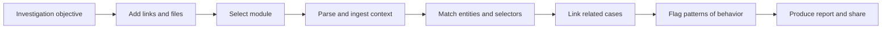
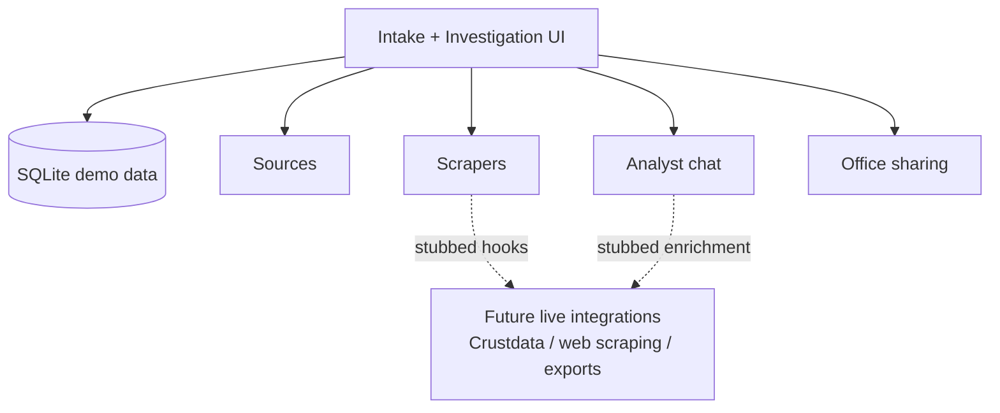

# Holocron

> A hackathon demo for turning scattered counter-narcotics research into a shared investigation workspace.

`Rails 8` `Hotwire` `Tailwind` `SQLite` `USWDS-inspired UI` `demo dataset`

Holocron is built for an analyst like Frances at State/INL: start with an objective, ingest links and context, map that input onto an existing module, and surface the entities, selectors, related cases, and behavior patterns that matter fastest. The current repo is optimized as a polished demo with seeded data, stubbed scraping/enrichment hooks, and a clear end-to-end workflow.

## Why This Matters

- Analysts start from fragmented context: links, notes, documents, spreadsheets, and marketplace traces.
- Existing workflows are slow, manual, and hard to share across offices.
- Holocron compresses that into one guided flow: intake, triage, enrichment, and investigation handoff.

## Demo Flow



## What Reviewers Should Look At

1. Start on the intake screen and enter any investigation objective.
2. Watch the setup sequence simulate parsing, scraping, and module matching.
3. Land in `Investigation Home` and click through:
   `Context Entities`, `Selectors`, `Related Cases`, and `Patterns of Behavior`.

## Workflow Screens

### 1. Intake


The analyst defines the mission, attaches context, and selects a prebuilt module to accelerate matching.

### 2. Parsing


The app stages the work as a pipeline so the user understands what is happening before the workspace opens.

### 3. Investigation Home


The core workspace summarizes what was matched and turns the investigation into a browsable operating picture.

### 4. Related Cases


Cross-case overlap is surfaced directly so teams can pivot from raw research to active investigations.

### 5. Patterns of Behavior


The strongest demo moment is not just data collection, but the system identifying recurring tactics and tradecraft.

## System Snapshot



## Current Scope

- Live today: intake flow, setup simulation, investigation views, source records, scraper records, sharing model, seeded/demo data.
- Stubbed by design for the hackathon: external scraping, live enrichment, report generation, and publish/export actions.
- Best framing for judges: this is a strong product demo with the right architecture seams already in place.

## Run Locally

```bash
bundle install
bin/rails db:prepare db:seed
bin/dev
```

Open `http://localhost:3000`.

## Stack

- Ruby `3.3.6`
- Rails `8`
- SQLite
- Hotwire + Stimulus
- Tailwind CSS

