# SQLite Data Diagram

This documents the SQLite data that already exists under `scraping/chemnet/dbs/`.

## Overview

The `scraping/chemnet/` dataset is not one SQLite file. It is a small family of per-source SQLite databases:

- `chemnet_com.sqlite3`
- `chem_intl.sqlite3`
- `chem_china.sqlite3`
- `china_chemnet.sqlite3`
- `dea.sqlite3`
- `eu_uk.sqlite3`
- `incb.sqlite3`
- `pubchem.sqlite3`
- `wikipedia.sqlite3`

Each DB represents one source family. The common join concepts across them are:

- `cas_number` / `cas_numbers` / `product_cas` / `query_cas`
- chemical name fields like `chemical_name`, `name`, `drug_name`, `product_name`
- supplier fields like `supplier_id`, `supplier_name`

## High-Level Diagram

```text
scraping/chemnet/dbs/
|
+-- chemnet_com.sqlite3
|   +-- chemnet_raw_queries
|   +-- chemnet_products
|   \-- chemnet_suppliers
|
+-- chem_intl.sqlite3
|   +-- intl_raw_queries
|   +-- intl_products
|   \-- intl_suppliers
|
+-- chem_china.sqlite3
|   +-- china_raw_queries
|   +-- china_products
|   \-- china_suppliers
|
+-- china_chemnet.sqlite3
|   +-- china_chemnet_raw_queries
|   +-- china_chemnet_products
|   \-- china_chemnet_hot_products
|
+-- dea.sqlite3
|   +-- dea_precursors
|   +-- dea_schedules
|   \-- dea_orange_book
|
+-- eu_uk.sqlite3
|   +-- eu_precursors
|   +-- uk_controlled_drugs
|   \-- emcdda_nps
|
+-- incb.sqlite3
|   +-- incb_red_list
|   +-- incb_yellow_list
|   \-- incb_green_list
|
+-- pubchem.sqlite3
|   +-- pubchem_compounds
|   +-- pubchem_classifications
|   \-- pubchem_synonyms
|
\-- wikipedia.sqlite3
    +-- wikipedia_pages
    \-- wikipedia_compounds
```

## Relationship Diagram

```mermaid
flowchart TD
    A[chemnet_com.sqlite3] --> A1[chemnet_raw_queries]
    A --> A2[chemnet_products]
    A --> A3[chemnet_suppliers]
    A2 -. query_cas .- B2
    A2 -. supplier_id / supplier_name .- A3

    B[chem_intl.sqlite3] --> B1[intl_raw_queries]
    B --> B2[intl_products]
    B --> B3[intl_suppliers]
    B2 -. query_cas .- C2
    B2 -. supplier_name .- B3

    C[chem_china.sqlite3] --> C1[china_raw_queries]
    C --> C2[china_products]
    C --> C3[china_suppliers]
    C2 -. supplier_name .- C3

    D[china_chemnet.sqlite3] --> D1[china_chemnet_raw_queries]
    D --> D2[china_chemnet_products]
    D --> D3[china_chemnet_hot_products]

    E[dea.sqlite3] --> E1[dea_precursors]
    E --> E2[dea_schedules]
    E --> E3[dea_orange_book]

    F[eu_uk.sqlite3] --> F1[eu_precursors]
    F --> F2[uk_controlled_drugs]
    F --> F3[emcdda_nps]

    G[incb.sqlite3] --> G1[incb_red_list]
    G --> G2[incb_yellow_list]
    G --> G3[incb_green_list]

    H[pubchem.sqlite3] --> H1[pubchem_compounds]
    H --> H2[pubchem_classifications]
    H --> H3[pubchem_synonyms]
    H2 -. cid .- H1
    H3 -. cid .- H1

    I[wikipedia.sqlite3] --> I1[wikipedia_pages]
    I --> I2[wikipedia_compounds]
    I2 -. page_title .- I1

    E1 -. cas_numbers .- H1
    E2 -. cas_numbers .- H1
    F1 -. cas_number .- H1
    F2 -. cas_number .- H1
    F3 -. cas_number .- H1
    G1 -. cas_number .- H1
    G2 -. cas_number .- H1
    G3 -. cas_number .- H1
    I2 -. cas_numbers .- H1
```



## What Each Database Looks Like

### Marketplace databases

These track search queries, products found, and supplier records.

`chemnet_com.sqlite3`
- `chemnet_raw_queries`: search request log
- `chemnet_products`: product listings keyed by `query_cas`, `product_cas`, `supplier_id`
- `chemnet_suppliers`: supplier profiles keyed by `supplier_id`

`chem_intl.sqlite3`
- `intl_raw_queries`: per-site query log
- `intl_products`: international marketplace hits
- `intl_suppliers`: supplier profiles keyed by `source_site + supplier_name + supplier_url`

`chem_china.sqlite3`
- `china_raw_queries`: per-site query log
- `china_products`: China-focused marketplace hits
- `china_suppliers`: supplier profiles

`china_chemnet.sqlite3`
- `china_chemnet_raw_queries`: query audit table
- `china_chemnet_products`: product result pages
- `china_chemnet_hot_products`: hot-product index pages

### Regulatory/reference databases

These are used to anchor the marketplace signal against known controlled chemicals.

`dea.sqlite3`
- `dea_precursors`
- `dea_schedules`
- `dea_orange_book`

`eu_uk.sqlite3`
- `eu_precursors`
- `uk_controlled_drugs`
- `emcdda_nps`

`incb.sqlite3`
- `incb_red_list`
- `incb_yellow_list`
- `incb_green_list`

`pubchem.sqlite3`
- `pubchem_compounds`: canonical compound record keyed by `cid`
- `pubchem_classifications`: one-to-many from `cid`
- `pubchem_synonyms`: one-to-many from `cid`

`wikipedia.sqlite3`
- `wikipedia_pages`: source page metadata
- `wikipedia_compounds`: extracted rows keyed loosely by `page_title`

## Practical Join Model

If you want to reason about the data as one graph, the simplest mental model is:

```text
raw query
  -> product listing
  -> supplier
  -> CAS number / chemical name
  -> regulatory/reference rows
  -> normalized compound context
```

In practice:

1. Start from marketplace product tables such as `chemnet_products`, `intl_products`, or `china_products`.
2. Join to supplier tables on `supplier_id` or `supplier_name`.
3. Join outward on CAS fields like `product_cas`, `query_cas`, or `cas_number`.
4. Use `pubchem_compounds` as the cleanest chemistry anchor when CAS is available.

## Representative Table Shapes

`chemnet_products`
- `query_chemical`
- `query_cas`
- `product_name`
- `product_cas`
- `supplier_id`
- `supplier_name`
- `supplier_country`
- `purity`
- `grade`
- `min_order`
- `price`
- `product_url`
- `fetched_at`

`chemnet_suppliers`
- `supplier_id`
- `supplier_name`
- `country`
- `city`
- `website`
- `description`
- `chemnet_url`
- `address`
- `email`
- `telephone`
- `fax`
- `fetched_at`

`pubchem_compounds`
- `cid`
- `iupac_name`
- `molecular_formula`
- `molecular_weight`
- `canonical_smiles`
- `inchi`
- `inchi_key`
- `cas_primary`
- `source_tag`
- `fetched_at`

## Useful Queries

List tables in one DB:

```sql
.tables
```

Inspect schema:

```sql
.schema chemnet_products
```

Find marketplace rows that can be matched to PubChem by CAS:

```sql
SELECT
  p.product_name,
  p.product_cas,
  p.supplier_name,
  c.cid,
  c.iupac_name
FROM chemnet_products p
LEFT JOIN pubchem_compounds c
  ON p.product_cas = c.cas_primary
LIMIT 25;
```

Find suppliers listing chemicals that also appear on control lists:

```sql
SELECT
  p.supplier_name,
  p.product_name,
  p.product_cas,
  d.name AS dea_name
FROM chemnet_products p
JOIN dea_precursors d
  ON p.product_cas = d.cas_numbers
LIMIT 25;
```
